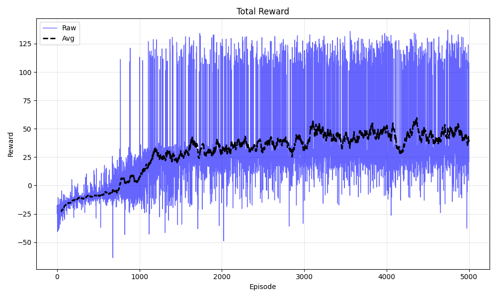
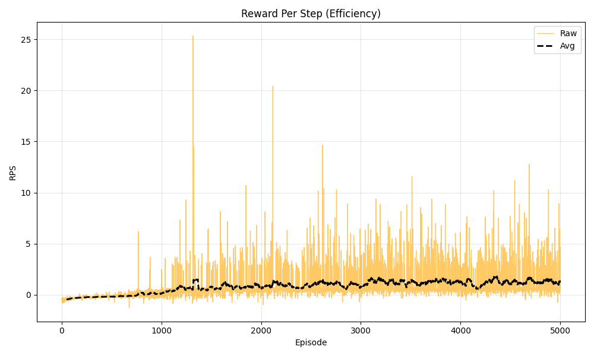
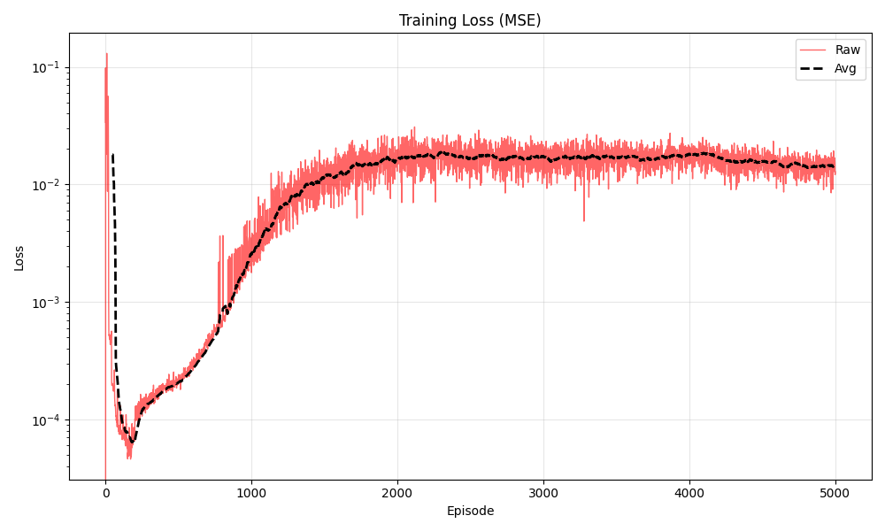
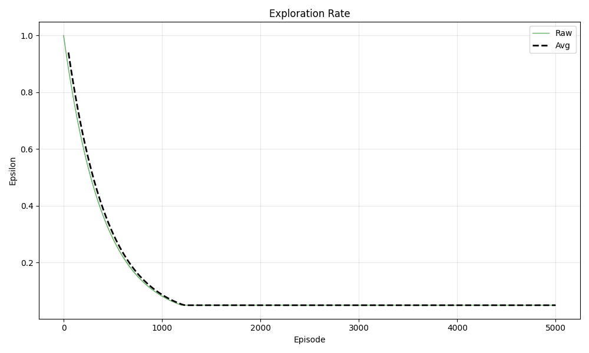
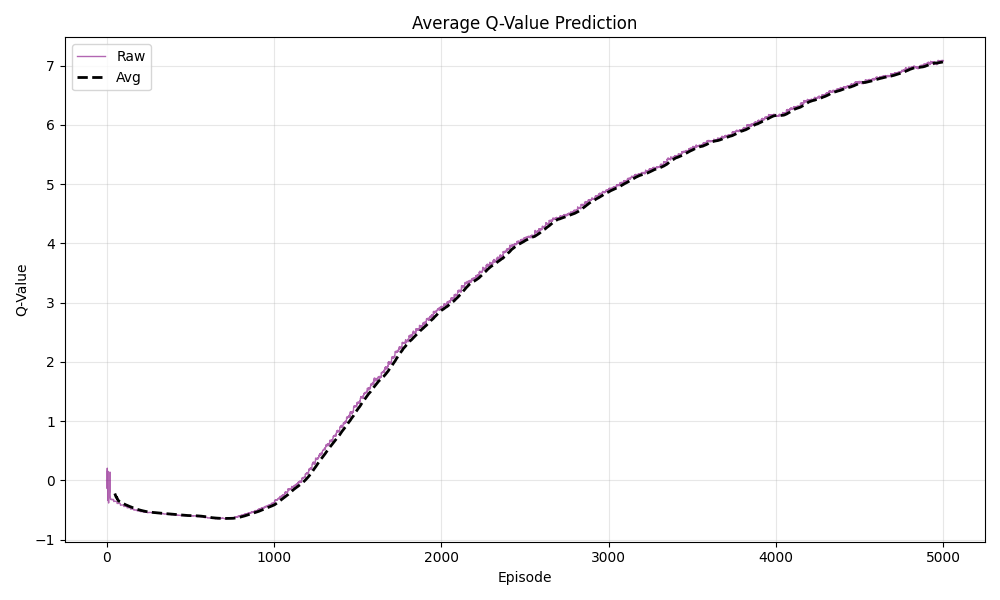
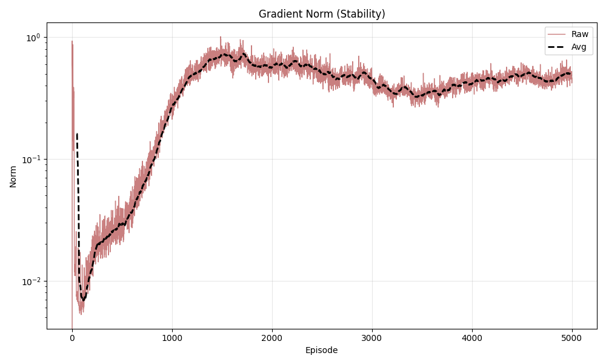
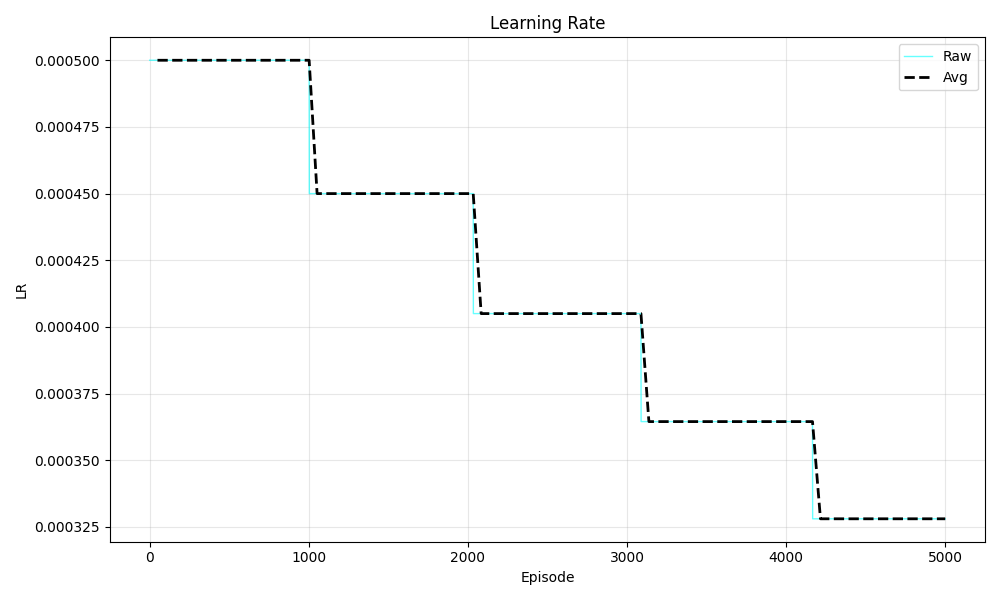

# DQN-Based Robotic Manipulation: Object Pushing Task

A Deep Q-Network implementation for learning robotic manipulation using high-level state representation and differential inverse kinematics.

## Overview

This project implements a DQN agent that learns to push an object to a target position using a 6-DOF robotic arm. The agent operates in Cartesian space using discrete actions and leverages high-level state information (positions) rather than raw pixels for faster training.

## Key Features

- **High-Level State Representation**: Uses concatenated positions (end-effector, object, goal) as 9D state vector
- **Differential IK Control**: Actions are Cartesian displacement commands executed via inverse kinematics
- **Double DQN**: Reduces Q-value overestimation bias
- **Dueling Architecture**: Separates state-value and advantage streams (optional)
- **Experience Replay**: 50,000-step buffer with batch sampling
- **Epsilon-Greedy Exploration**: Decays from 1.0 to 0.05 over training
- **Comprehensive Logging**: TensorBoard integration and automatic plot generation

## Project Structure

```
.
├── train.py                 # Main training script
├── play.py                  # Evaluation/visualization script
├── agent.py                 # DQN agent implementation
├── models.py                # Neural network architecture
├── replay_buffer.py         # Experience replay buffer
├── config.py                # Hyperparameters
├── utils.py                 # Checkpointing and plotting utilities
├── homework2.py             # Modified environment with IK control
├── environment.py           # Base MuJoCo environment
├── checkpoints/             # Saved models and training history
│   └── YYYY-MM-DD_HH-MM-SS/
│       ├── plots/           # Training curves
│       ├── video/           # Evaluation recordings
│       ├── checkpoint_ep*.pth
│       └── final_model.pth
└── README.md
```

## Environment Details

### State Space (High-Level)

The agent receives a 9-dimensional state vector:

```
[EE_x, EE_y, EE_z, Obj_x, Obj_y, Obj_z, Goal_x, Goal_y, Goal_z]
```

- **EE**: End-effector position (gripper tip)
- **Obj**: Object position (red cube)
- **Goal**: Target position (green cylinder marker)

### Action Space

6 discrete Cartesian displacement actions:

| Action ID | Direction     | Delta  |
| --------- | ------------- | ------ |
| 0         | Forward (+X)  | +0.05m |
| 1         | Backward (-X) | -0.05m |
| 2         | Left (-Y)     | -0.05m |
| 3         | Right (+Y)    | +0.05m |
| 4         | Up (+Z)       | +0.05m |
| 5         | Down (-Z)     | -0.05m |

Actions are clamped to workspace limits:
- X: [0.3, 0.75]
- Y: [-0.4, 0.4]
- Z: [1.02, 1.3]

### Reward Function

The reward structure encourages both approaching the object and moving it to the goal:

```python
reward = 0

# 1. Approach penalty (encourages getting close to object)
reward -= dist_ee_obj * 2.0

# 2. Goal reward (when gripper is near object)
if dist_ee_obj < 0.05:
    reward += 1.0                    # Grasping bonus
    reward -= dist_obj_goal * 5.0    # Strong goal incentive

# 3. Success bonus
if dist_obj_goal < 0.02:
    reward += 100.0
```

**Reward Scaling**: Raw rewards are divided by 10.0 during training to keep Q-values stable (approximately 0.5 to 2.0 range). Logged rewards show unscaled values for interpretability.

### Termination Conditions

- **Success**: Object within 0.02m of goal
- **Timeout**: 50 timesteps elapsed

## Neural Network Architecture

### MLP Q-Network

Compact fully-connected network for high-level state:

```
Input (9D state)
    ↓
Linear(9 → 128) + LayerNorm + ReLU
    ↓
Linear(128 → 64) + LayerNorm + ReLU
    ↓
Linear(64 → 6) [Q-values]
```

**Design Choices**:
- LayerNorm for training stability
- ReLU activation for non-linearity
- No dropout (sufficient regularization from experience replay)
- Output layer has no activation (raw Q-values)

## Training Algorithm

### Double DQN Update Rule

1. **Action Selection** (Policy Network):
   ```
   a' = argmax_a Q_policy(s', a)
   ```

2. **Action Evaluation** (Target Network):
   ```
   Q_target = r + γ * Q_target(s', a')
   ```

3. **Loss Computation**:
   ```
   Loss = SmoothL1(Q_policy(s, a), Q_target)
   ```

### Hyperparameters

```python
HYPERPARAMS = {
    "gamma": 0.99,              # Discount factor
    "lr": 0.0005,               # Learning rate
    "batch_size": 128,          # Replay batch size
    "buffer_length": 50000,     # Replay buffer capacity
    
    "epsilon_start": 1.0,       # Initial exploration
    "epsilon_decay": 0.995,     # Decay rate
    "min_epsilon": 0.05,        # Final exploration
    "epsilon_decay_iter": 100,  # Decay frequency
    
    "update_freq": 1,           # Policy net update interval
    "target_update_freq": 1000, # Target net sync interval
    
    "n_episodes": 5000,         # Total training episodes
    "checkpoint_freq": 50,      # Save interval
}
```

## Installation

```bash
# Clone repository
git clone <repository-url>
cd <repository-name>

# Install dependencies
pip install torch numpy mujoco matplotlib tensorboard

# For headless servers
export MUJOCO_GL=egl
export PYOPENGL_PLATFORM=egl
```

## Usage

### Training

Start new training run:
```bash
python train.py
```

Resume from checkpoint:
```bash
python train.py checkpoints/2026-03-12_11-17-00
```

Training outputs:
- **Checkpoints**: Saved every 50 episodes to `checkpoints/TIMESTAMP/`
- **Plots**: Auto-generated in `checkpoints/TIMESTAMP/plots/`
- **TensorBoard**: Logs in `checkpoints/TIMESTAMP/tensorboard/`
- **Console Log**: Detailed per-episode statistics

Example training output:
```
Ep 1250 | Rw: 15.3 | Loss: 0.0234 | Q: 1.45 | Grad: 2.31 | Eps: 0.087 | Time: 3.2s
```

### Evaluation

Play trained model with visualization:
```bash
python play.py checkpoints/2026-03-12_11-17-00 --episodes 5 --render_dt 0.05
```

Arguments:
- `checkpoint_dir`: Path to checkpoint directory (defaults to latest)
- `--episodes`: Number of episodes to run (default: 5)
- `--render_dt`: Time delay between steps in seconds (default: 0.05)
  - 0.02: Fast/real-time
  - 0.05: Moderate speed
  - 0.30: Slow motion
- `--no-gui`: Run without rendering
- `--verbose`: Print step-by-step details

**Smart Sleep Implementation**: The play script uses a custom `smart_sleep()` function that keeps the GUI responsive during delays by continuously calling `render()`, preventing "Application Not Responding" freezes.

**Manual Success Detection**: Play script includes explicit success checking with visual feedback and automatic episode termination when the object reaches the goal.

### Checkpoint Management

Checkpoints are automatically saved in timestamped directories:

```
checkpoints/2026-03-12_11-17-00/
├── checkpoint_ep50.pth
├── checkpoint_ep100.pth
├── latest_checkpoint.pth    # Most recent save
├── final_model.pth          # Training completion
├── training.log             # Detailed text log
├── plots/                   # PNG training curves
└── tensorboard/             # TensorBoard logs
```

Each checkpoint contains:
- Policy network weights
- Target network weights
- Optimizer state
- Learning rate scheduler state
- Epsilon value
- Complete training history (rewards, loss, Q-values, gradients, learning rate)

### Visualization

View TensorBoard logs:
```bash
tensorboard --logdir=stable_ckpt
```
or
```bash
tensorboard --logdir=checkpoints
```

Training plots are automatically generated in `plots/`:

#### Reward Progression


Total reward improves from -25 (early random policy) to 37+ (trained policy) over 5000 episodes. The black dashed line shows the 50-episode moving average, demonstrating steady learning progress with reduced variance after episode 2000.

#### Reward Per Step (Efficiency)


RPS measures reward efficiency per timestep. Increases from negative values to ~0.7, indicating the agent learns to complete tasks in fewer steps while maximizing reward.

#### Training Loss


TD-error (Huber loss) decreases rapidly in first 500 episodes, then stabilizes around 0.01-0.1. Log scale shows convergence to stable Q-value predictions.

#### Exploration Rate (Epsilon)


Epsilon decays from 1.0 (full exploration) to 0.05 (5% random actions) over 1200 episodes, balancing exploration and exploitation during learning.

#### Q-Value Predictions


Average Q-values increase continuously from ~0.5 to ~2.0, reflecting the agent's growing confidence in achieving higher cumulative rewards. Stable growth indicates proper reward scaling.

#### Gradient Norms


Gradient magnitudes remain stable throughout training due to gradient clipping (max norm: 10.0), preventing training instability.

#### Learning Rate Schedule


LR decays from 0.0005 to 0.000325 via StepLR scheduler (gamma=0.9 every 500 updates), enabling fine-tuning in later stages while maintaining early learning speed.

## Results

### Performance Metrics

Evaluation on 5 episodes with trained model:

```
Episode 1: 12.58 reward, SUCCESS (11 steps, dist: 0.023m)
Episode 2: 11.17 reward, SUCCESS (12 steps, dist: 0.029m)
Episode 3: 12.03 reward, SUCCESS (23 steps, dist: 0.023m)
Episode 4: 15.62 reward, SUCCESS (11 steps, dist: 0.027m)
Episode 5: 11.99 reward, SUCCESS (6 steps, dist: 0.020m)

Success Rate: 5/5 (100.0%)
Average Reward: 12.68
Average Steps to Success: 12.6
```

### Demo Video

https://github.com/user-attachments/assets/4ef96292-508a-47a5-bbd8-5d2bbe843ffb

*Trained agent successfully pushing the red cube to the green goal marker across 5 randomized scenarios with 100% success rate.*

**Note**: Average reward (12.68) is lower than training plot peaks (37+) because the play script terminates episodes immediately upon success, while training episodes continue until timeout, accumulating additional rewards.

## Implementation Details

### Agent (agent.py)

The DQNAgent class implements:

- **Double DQN**: Decouples action selection from evaluation
- **Huber Loss**: More robust than MSE for outliers
- **Gradient Clipping**: Prevents exploding gradients (max norm: 10.0)
- **Soft Target Updates**: Optional Polyak averaging for smoother learning
- **Learning Rate Scheduling**: StepLR decay every 500 updates (gamma: 0.9)
- **L2 Regularization**: Weight decay of 1e-5

Key methods:
- `select_action()`: Epsilon-greedy with proper tensor handling
- `update()`: Performs one optimization step, returns (loss, avg_q, grad_norm)
- `decay_epsilon()`: Called once per episode
- `get_state_dict()` / `load_state_dict()`: Checkpointing interface

### Replay Buffer (replay_buffer.py)

Standard uniform sampling buffer:
- Fixed capacity (50,000 transitions)
- Returns batched tensors: (state, action, reward, next_state, done)
- Efficient numpy-based storage with torch conversion on sampling

### Utilities (utils.py)

Comprehensive helper functions:

- `create_checkpoint_dir()`: Creates timestamped directory
- `save_checkpoint()`: Saves agent + history
- `load_checkpoint()`: Loads with backward compatibility
- `find_latest_checkpoint()`: Locates most recent .pth file
- `save_all_plots()`: Generates 7 separate PNG plots with moving averages
- `Logger`: Dual console/file logging

### Environment Modifications (homework2.py)

Key changes from base assignment:

1. **Differential IK Integration**: Actions are Cartesian deltas executed via `_set_ee_in_cartesian()`
2. **Workspace Clamping**: Prevents invalid IK targets
3. **Forced Reset Position**: Robot returns to "home" pose (0.5, 0.0, 1.05) at episode start
4. **Direct State Return**: `reset()` and `step()` return high-level state immediately
5. **Modified Reward**: Combines approach penalty, grasping bonus, and goal incentive
6. **Reduced Max Steps**: 50 timesteps (vs original 100) for faster episodes


## Differences from Original Assignment

The original assignment suggested using:
- **CNN architecture** for pixel-based state (128x128 RGB images)
- **8 discrete actions** (likely including rotations)
- **Reward**: `1/dist(ee, obj) + 1/dist(obj, goal)`

Our implementation uses:
- **MLP architecture** for high-level state (9D position vector)
- **6 discrete actions** (pure translation)
- **Modified reward** with approach penalty + grasping bonus + goal incentive
- **Differential IK** for smoother control
- **Reward scaling** for Q-value stability

These changes significantly accelerate training while maintaining task performance.

## References

- Mnih et al. (2015): Human-level control through deep reinforcement learning
- Van Hasselt et al. (2016): Deep Reinforcement Learning with Double Q-learning
- Wang et al. (2016): Dueling Network Architectures for Deep Reinforcement Learning

## License

This project is part of CMPE 591 coursework.
